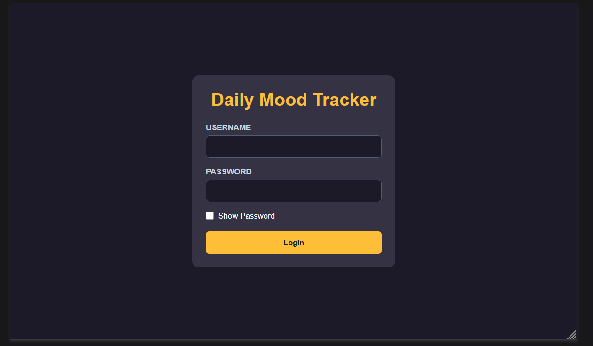
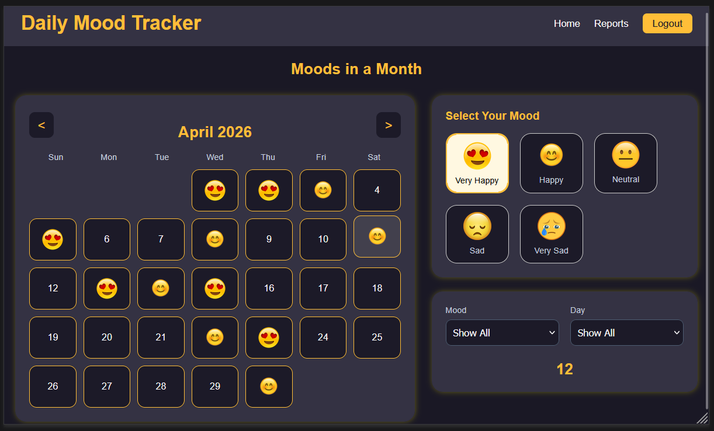
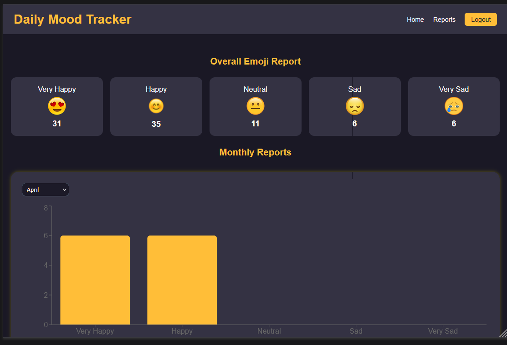
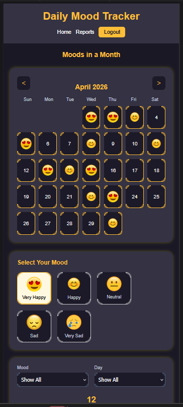

# 😊 Daily Mood Tracker


A **responsive Daily Mood Tracker** built using **React.js** that allows users to track their daily moods using emojis and visualize emotional patterns through analytics.

This project demonstrates my ability to design, build, and deploy a complete frontend application using React.


## 🚀 Live Demo
🔗  https://daily-mood-tracker-two.vercel.app/


## 🎯 Project Purpose

This project demonstrates my understanding of React fundamentals, state management, routing, and building a complete frontend application from scratch.

Initially, I struggled with:

- Component structure
- Props and data flow
- State management
- Routing

By building this project, I transformed my understanding from:

❌ Confusion → ✅ Confidence in React development


## ✨ Features
### 🔐 Authentication & Routing
- Login page with mock authentication
- Protected routes (restricted access without login)

### 📅 Mood Tracking System
- Calendar-based mood tracking
- Add / replace / remove emoji for each day
- Month & year navigation

### 🎯 Advanced Filtering (UX-Focused)
- Filter moods by emoji and day
- Non-destructive filtering (UI changes without modifying data)

### 📊 Analytics Dashboard
- Overall emoji count
- Monthly mood insights using bar charts (Recharts)

### 💾 Data Persistence
- Stores mood data using localStorage
- Data persists across refresh and sessions

### 📱 Responsive Design
- Fully responsive (Desktop, Tablet, Mobile)

### 🧩 Clean Architecture
- Component-based structure
- Organized folders (components, pages, routes)


## 🛠️ Tech Stack

- **Frontend** : React, JavaScript, CSS
- **Routing** : React Router
- **Charts** : Recharts
- **State Management** : useState
- **Storage** : localStorage
- **Deployment** : Vercel


## 🧩 System Design / Architecture


- I designed this structure before implementation to avoid confusion during development.

### Key Highlights:
- Clear separation between Pages, Components, and Routes
- Implemented Protected Routes
- Reusable components (Calendar, Filters, Emoji Selector)
- Clean data flow between components

## 📂 Project Structure

```plaintext
Daily-Mood-Tracker/
├── assets/                 # Images (screenshots, architecture diagram)
├── public/                 # Static files
├── src/
│   ├── components/         # Reusable UI components
│   │   ├── Header/
│   │   ├── EmojiSelector/
│   │   ├── Calendar/
│   │   └── Filters/
│   ├── pages/              # Application pages
│   │   ├── Login/
│   │   ├── Home/
│   │   ├── Reports/
│   │   └── NotFound/
│   ├── routes/             # Routing & protected routes
│   │   └── ProtectedRoute.jsx
│   ├── services/           # Business logic (auth, data handling)
│   │   └── authService.js
│   ├── utils/              # Helper functions/constants
│   │   └── constants.js
│   ├── App.jsx             # Root component
│   ├── main.jsx            # Entry point
│   └── index.css           # Global styles
├── index.html              # HTML template
├── package.json
├── package-lock.json
├── README.md
└── .gitignore

```
## 🧠 Architecture Explanation
- components/ → Reusable UI elements
- pages/ → Application screens
- routes/ → Navigation & protected routing
- services/ → Core logic (auth, data handling)
- utils/ → Helper functions

#### This structure improves:

- Scalability
- Maintainability
- Code clarity


## 🧠 Key Concepts Implemented
- Component-based architecture
- State management using useState
- State lifting & shared state handling
- Controlled components
- Derived state (filtered & aggregated data)
- React Router & protected routes
- Non-destructive filtering (UX optimization)
- Dynamic calendar logic
- Client-side persistence (localStorage)
- Data visualization using charts
- Responsive design with CSS Grid & Flexbox

## ⚡ Challenges & Solutions

### 1. Data Flow Between Components
- Initially struggled to understand how data moves across components.
- ✅ Solved using props and state lifting.

### 2. State Management Issues
- UI was not updating correctly on state changes.
- ✅ Improved by practicing with smaller examples and applying the logic.

### 3. Debugging Problems
- Faced issues with incorrect rendering and data updates.
- ✅ Used console.log() and step-by-step debugging.

### 4. Routing & Protected Routes
- Had difficulty implementing navigation and access control.
- ✅ Implemented protected routes using React Router.

### 5. Data Persistence Without Backend
- Needed to retain data without a database.
- ✅ Used localStorage for client-side persistence.


## 🖼️ Screenshots

### Login Page


### Home Page


### Reports Page


### Mobile View


## ▶️ How to Run Locally

```bash
git clone https://github.com/ybhavanareddy/daily-mood-tracker.git
cd daily-mood-tracker
npm install
npm start

```

## 🚀 Future Improvements
- Backend integration
- Real authentication
- Cloud storage

# 🙋‍♀️ About Me

- I am a frontend developer focused on learning by building real-world projects.

- This project represents my journey from understanding React basics to confidently building a complete application.

## 📜 License

This project is licensed under the MIT License.

🔗 LinkedIn
http://www.linkedin.com/in/yatham-bhavana

⭐ If you like this project, give it a star!
